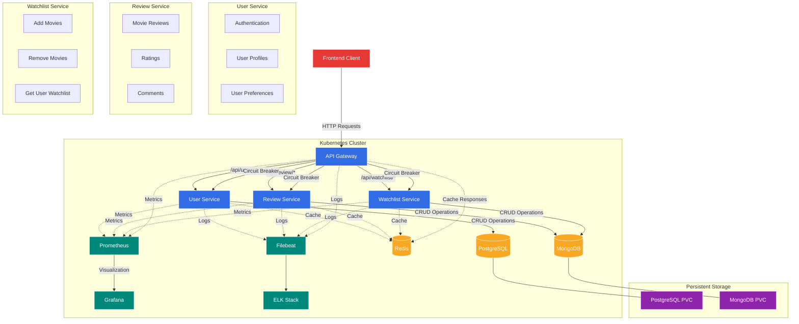

# CineRate Microservices Architecture

This document provides an overview of the CineRate microservices architecture, illustrating the system components, their relationships, and data flow.

## Architecture Diagram

## Core Components

### API Gateway
- Entry point for all client requests
- Routes requests to appropriate microservices
- Implements circuit breaker pattern for fault tolerance
- Handles caching of responses using Redis

### User Service
- Manages user authentication and profiles
- Uses PostgreSQL for persistent data storage
- Implements circuit breaker for external service calls
- Exposes metrics for monitoring

### Review Service
- Handles movie reviews and ratings
- Uses MongoDB for document storage
- Implements caching for frequently accessed reviews
- Exposes health endpoints and metrics

### Watchlist Service
- Manages user movie watchlists
- Uses MongoDB with persistent storage (StatefulSet)
- Implements proper cache invalidation
- Provides CRUD operations for watchlist items

## Infrastructure Components

### Databases
- PostgreSQL: User data (with persistent volume)
- MongoDB: Reviews and watchlists (with persistent volume)
- Redis: Caching layer for all services

### Monitoring & Logging
- Prometheus: Metrics collection
- Grafana: Metrics visualization and dashboards
- ELK Stack: Centralized logging
- Filebeat: Log shipping agent

### Kubernetes Resources
- Deployments for stateless services
- StatefulSets for databases
- Services for network access
- Secrets for sensitive configuration
- PersistentVolumeClaims for data persistence

## Key Design Patterns

### Circuit Breaker Pattern
- Prevents cascading failures
- Provides fallback responses when services are down
- Automatically recovers when services become available

### Caching Strategy
- Redis used for caching frequently accessed data
- Cache invalidation on write operations
- TTL-based expiration for different data types

### Health Monitoring
- All services expose health endpoints
- Prometheus scrapes metrics from all services
- Grafana dashboards visualize service health
